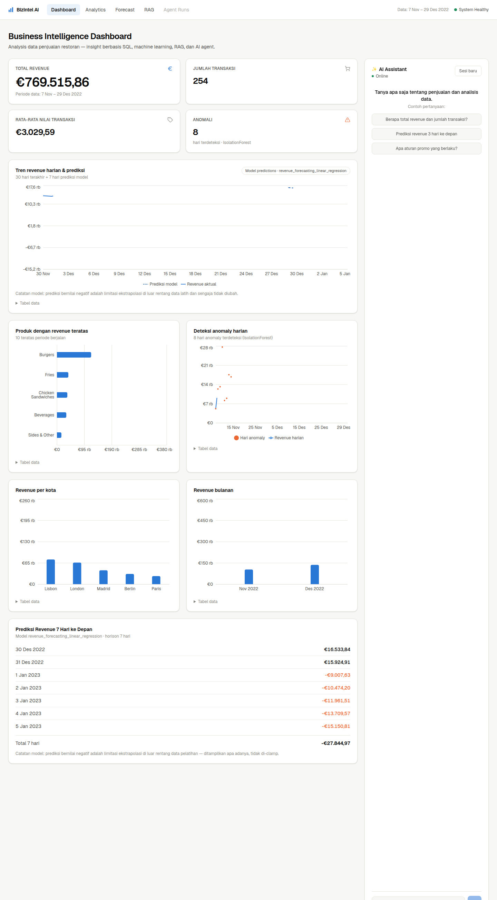
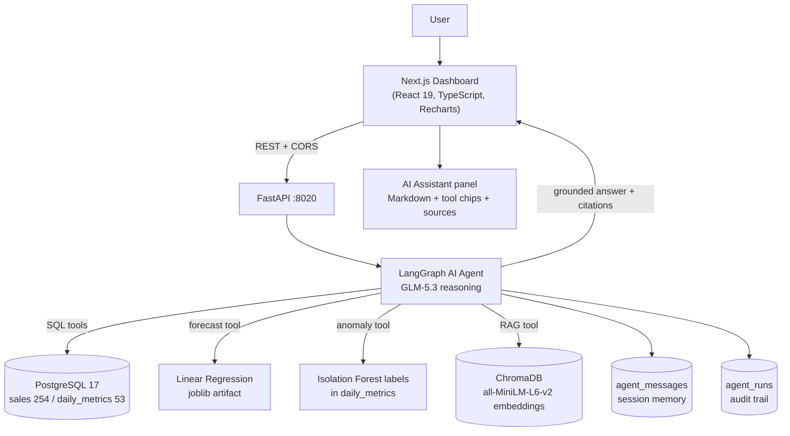

# BizIntel AI — AI-Powered Business Intelligence & Decision Support Agent

[](https://www.python.org/)
[](https://fastapi.tiangolo.com/)
[](https://nextjs.org/)
[](https://www.postgresql.org/)
[](https://docs.docker.com/compose/)
[](#20-testing)
[](#23-license)

BizIntel AI is a **portfolio/demo business intelligence platform** for restaurant sales data. It combines a PostgreSQL analytics layer, machine-learning revenue forecasting, anomaly detection, retrieval-augmented generation (RAG), and a LangGraph agentic workflow with tool calling, per-session conversation memory, audit logging, and a deterministic evaluation harness — presented through a custom Next.js BI dashboard with a grounded AI Assistant.

**🔗 Live demo (free-tier cloud deployment):**

| | URL | What you'll see |
|---|---|---|
| **Dashboard** | https://bizintelai-frontend.vercel.app | Full BI dashboard + grounded AI Assistant (chat works live) |
| **API** | https://bizintelai.vercel.app | REST API · interactive Swagger UI at [`/docs`](https://bizintelai.vercel.app/docs) |



<details>
<summary><strong>Live-demo notes (honest limitations of the serverless deployment)</strong></summary>

- The serverless bundle excludes ChromaDB (500 MB/function limit) → **RAG retrieval degrades fail-soft**: policy questions get the controlled "not available" answer instead of retrieved documents. Full RAG runs via the local Docker stack ([Quick Start](#14-quick-start)).
- Free tier realities: Supabase pauses after ~1 week idle (unpause via dashboard), Vercel functions have cold starts.
- Deployment architecture & runbook: [`docs/cloud-deployment.md`](docs/cloud-deployment.md).

</details>

Every number in this README comes from an actual, reproducible run in this repository (see [Testing](#20-testing), [Evaluation](#9-evaluation), and [`docs/data-and-model-reproducibility.md`](docs/data-and-model-reproducibility.md)).

## Contents

1. [Project Overview](#1-project-overview)
2. [Problem](#2-problem)
3. [Solution](#3-solution)
4. [Architecture](#4-architecture)
5. [Key Features](#5-key-features)
6. [AI Agent & Tool Calling](#6-ai-agent--tool-calling)
7. [Machine Learning](#7-machine-learning)
8. [RAG](#8-rag)
9. [Evaluation](#9-evaluation)
10. [Dashboard](#10-dashboard)
11. [Engineering & Security](#11-engineering--security)
12. [Tech Stack](#12-tech-stack)
13. [Project Structure](#13-project-structure)
14. [Quick Start](#14-quick-start)
15. [API Reference](#15-api-reference)
16. [Example Questions](#16-example-questions)
17. [Live Deployment](#17-live-deployment)
18. [Limitations](#18-limitations)
19. [Future Improvements](#19-future-improvements)
20. [Testing](#20-testing)
21. [Portfolio Disclaimer](#21-portfolio-disclaimer)
22. [Acknowledgments](#22-acknowledgments)
23. [License](#23-license)

## 1. Project Overview

The platform demonstrates an end-to-end data-to-decision pipeline:

- **ETL & modeling** — a Kaggle notebook produces clean datasets, forecast models, and anomaly labels
- **PostgreSQL** — 254 sales transactions and 53 daily metric records behind an idempotent schema
- **FastAPI** — parameterized analytics, forecasting, and chat endpoints with explicit error contracts
- **LangGraph AI agent** — a single agent with 8 measured tools (SQL analytics, ML forecast, RAG) that answers business questions *only* from tool output
- **Session memory & audit logging** — conversation history per `session_id`, plus a per-run audit trail in PostgreSQL
- **Evaluation harness** — deterministic evaluators (no LLM-as-a-judge) for tool selection, numerical accuracy, groundedness, citation correctness, and retrieval Hit@k
- **Next.js dashboard** — KPI cards, revenue trend with forecast overlay, product/city/monthly breakdowns, anomaly monitoring, and an AI Assistant with Markdown rendering and RAG citations

This is a portfolio project, not a fully deployed enterprise production system (see [Limitations](#18-limitations) and [Portfolio Disclaimer](#21-portfolio-disclaimer)).

## 2. Problem

Business stakeholders have questions ("What was December revenue?", "What will revenue be next week?", "What is the promotion policy?"), but the answers live in different systems:

- Historical metrics sit in a SQL database and require writing queries
- Forecasts require running a model with the right features
- Company policies live in documents nobody can search
- Generic chatbots hallucinate numbers when asked any of the above

## 3. Solution

One conversational interface backed by a **grounded agent**:

- The agent **selects tools** per question — SQL analytics, the ML forecast artifact, or RAG retrieval — and composes the answer **only from tool output**
- Numbers are traceable: every figure in a response comes from a query, a model artifact, or a retrieved document
- RAG answers carry `[file.md]` citations; the dashboard displays them as source chips
- Out-of-scope questions (profit margins, customer data, anything not in the database) are answered with an explicit "not available" contract instead of fabrication — verified by tests
- The dashboard visualizes the same grounded data (KPIs, trends, forecast, anomalies) so the agent's answers can be cross-checked visually

## 4. Architecture



One agent, one graph — no multi-agent orchestration, no MCP. The LLM is used for tool selection and answer composition; every number originates from a tool. Data flow into the system: `notebooks/` (EDA + ML) → `data/processed/*.csv` → `scripts/import_data.py` → PostgreSQL; `data/knowledge/*.md` → RAG ingest (chunk 700/80, local ONNX embeddings) → ChromaDB.

## 5. Key Features

- **BI dashboard** — KPI cards (revenue, transactions, quantity, anomaly watch), daily revenue trend, 7-day forecast overlay, top products, revenue by city, monthly aggregate, anomaly monitoring
- **AI Assistant** — grounded conversational analytics with session persistence, tool-visibility chips, RAG source citations, and Markdown-rendered responses (tables, bold, lists, code)
- **Explicit failure contracts** — `llm_not_configured` (503), `forecast_model_unavailable`; the API never fakes success
- **Fail-safe degradation** — without LLM credentials the dashboard, forecast, anomalies, and all analytics endpoints still work; only `/api/chat` returns 503
- **Per-widget states** — loading/error/empty handled independently for every dashboard card
- **Accessibility** — every chart has a twin data table (`<details>`), labelled inputs, `aria-live` chat thread
- **Responsive** — desktop layout with sticky assistant sidebar; mobile gets a drawer-based assistant
- **Dark mode** — follows the system color scheme

## 6. AI Agent & Tool Calling

A single LangGraph agent (`backend/app/agent/`) backed by GLM-5.3 (Anthropic-compatible endpoint). The system prompt enforces strict routing and grounding rules; the graph extracts text blocks from the model response (GLM returns thinking blocks by default).

**Tools (all read-only, whitelisted, parameterized — there is no arbitrary SQL tool):**

| Tool | Source |
|---|---|
| `get_kpi` | PostgreSQL aggregate |
| `get_revenue_by_period(start_date, end_date)` | PostgreSQL |
| `get_revenue_by_product` | PostgreSQL |
| `get_revenue_by_city` | PostgreSQL |
| `get_monthly_revenue` | PostgreSQL |
| `get_anomalies` | PostgreSQL (Isolation Forest labels) |
| `get_revenue_forecast(days)` | Linear Regression joblib artifact |
| `search_business_knowledge(query, top_k)` | ChromaDB RAG |

LangGraph routes each request to the appropriate tool and supports **multi-tool workflows** when a question contains multiple explicit information needs (e.g. "current KPIs *and* the 3-day forecast" → `get_kpi` + `get_revenue_forecast`).

**Grounding rules (enforced and tested):** numbers come only from tool output; unavailable data is answered with an explicit "not available" phrase without calling tools; citations may only name documents actually returned by retrieval; prompt-injection attempts are refused (covered by the OOD evaluation cases).

**Memory & audit:** conversation history (last 20 messages) is persisted per `session_id` in `agent_messages` (PostgreSQL); every run is recorded in `agent_runs` with status, `tools_used`, latency, and model name. `session_id` is validated against `^[A-Za-z0-9_.-]{1,128}$` (path traversal → 422).

The agent is not autonomous: it answers one grounded question at a time and takes no actions besides read-only retrieval.

## 7. Machine Learning

Modeling was done in the notebook (`notebooks/exploratory-data-analysis-and-predictive-models.ipynb`) on the Kaggle restaurant-sales dataset; artifacts are served by the API **without retraining**.

**Dataset:** 254 sales transactions over 53 days (2022-11-07 → 2022-12-29), total revenue €769,515.86, total quantity 116,995.31 — a small, single-season dataset (see [Limitations](#18-limitations)).

**Revenue forecasting** — recursive multi-step daily forecast with time-series feature engineering (7 features incl. lags/calendar), **chronological** train/test split, three candidates:

| Model | MAE | RMSE | MAPE |
|---|---|---|---|
| **Linear Regression** *(selected)* | **610.15** | **743.92** | **3.64%** |
| Random Forest | 1,373.23 | 1,550.74 | 8.15% |
| XGBoost | 1,529.68 | 1,787.81 | 9.05% |

These results are specific to this dataset and experiment — this is not a production-grade forecasting benchmark. Deterministic check: `days=3` forecasts 16,533.84 / 15,924.91 / −9,007.63.

**Known forecast limitation (intentionally not hidden):** the model was trained on Nov–Dec 2022 data. Because it uses calendar features and extrapolates beyond the observed training period, predictions can become unrealistic — **including negative values** (e.g. −9,007.63 and −15,150.81 at longer horizons). The dashboard and API display these values **as-is with a limitation note; no clamping** — the model's real behavior is shown, because hiding it would misrepresent the model. A production deployment would require stronger time-series methodology, longer history, proper validation, and business constraints.

**Anomaly detection** — Isolation Forest on daily Revenue, Quantity, and Transactions; flags **8 exploratory anomaly dates** out of 53.

> These anomaly labels are exploratory signals, not proof of fraud, data errors, or business misconduct.

## 8. RAG

Retrieval-augmented generation over business policy documents, included to demonstrate the architecture and workflow end-to-end:

- **Vector store:** ChromaDB (persistent, local)
- **Embeddings:** `all-MiniLM-L6-v2` ONNX, running locally via ChromaDB's default backend — no embedding API, no torch
- **Chunking:** deterministic 700 chars / 80 overlap → 21 chunks
- **Similarity:** cosine, with a **0.30 minimum-similarity threshold** (below it, the tool returns an honest empty result — no forced retrieval)
- **Citations:** responses cite sources as `[file.md]`; the evaluation verifies citations against **actual retrieval metadata** (fabricated or missing citations fail); the dashboard renders them as source chips

**Important:** the current knowledge base contains **5 synthetic/demo business policy documents** (`data/knowledge/*.md`: promotion, inventory, product, sales, business guidelines). They are **not real company policies** — they exist so the retrieval workflow can be demonstrated honestly.

## 9. Evaluation

A deterministic evaluation harness (`backend/app/evaluation/`, `scripts/evaluate_agent.py`) — **no LLM-as-a-judge**. It checks tool selection (set comparison), strict multi-format numerical parsing, conservative groundedness (1-step derived arithmetic allowed), citation correctness against actual retrieval metadata, out-of-domain/prompt-injection safety, and retrieval Hit@k against ChromaDB directly.

Dataset: 23 cases across 8 categories (SQL, ML, RAG, and combinations + out-of-domain), each expected value carrying `source` + `tool_args` so ground truth can be re-verified via the actual tools.

**Latest live run snapshot (GLM-5.3, 23 cases; `data/evaluation/latest_evaluation.json`):**

| Metric | Result |
|---|---|
| Cases passed | 22/23 |
| Tool selection | **23/23 (100%)** |
| Numerical accuracy | 20/20 values |
| Groundedness | 19/19 |
| Citation correctness | 8/9 |
| Out-of-domain safety | 4/4 |
| Multi-tool success | 4/5 |
| Retrieval Hit@1 / Hit@3 / Hit@4 | 8/9 · 9/9 · 9/9 |
| Latency mean / median / p95 | 14.9 s / 13.0 s / 28.4 s |

Best observed run reached multi-tool 5/5 and citation 9/9; live results vary between runs (18–22/23 observed) and are reported as-is. Multi-turn session mode (4 sessions, 8 turns): 4/4 sessions passed, 8/8 turn tool selection, 3/3 out-of-domain follow-ups. The deterministic ground-truth mode verifies 21/21 values.

These metrics describe performance **on this project's test cases and live LLM runs** — they are not a universal model accuracy claim, and no overall score is implied.

## 10. Dashboard

Custom **Next.js 16** (App Router) + **React 19** + **TypeScript (strict)** + **Tailwind CSS 4** + **Recharts** frontend:

- KPI cards with independent loading/error/empty states
- Daily revenue trend with **7-day model forecast** overlay (dashed; negative extrapolated values shown honestly with a limitation note)
- Top products, revenue by city, monthly aggregate (single-hue bars, CVD-safe palette)
- Anomaly monitoring panel (flags from `daily_metrics`)
- **AI Assistant** panel: session persistence, tool chips (`tools_used`), RAG source chips, loading/error states, sample questions, responsive mobile drawer
- Assistant responses render **Markdown** (GFM tables, bold, lists, code) via `react-markdown` + `remark-gfm` — safe by default (no raw HTML execution); user messages stay plain text
- Every chart ships an accessible twin data table; dark mode follows the system

## 11. Engineering & Security

Implemented protections (this is not a security certification, and no enterprise compliance is claimed):

- **Parameterized PostgreSQL queries** everywhere; analytics tools are read-only and whitelisted
- **No arbitrary SQL tool** — the agent cannot execute user-supplied SQL
- **Session ID validation** (`^[A-Za-z0-9_.-]{1,128}$`); memory store failures are fail-closed (503), not silently ignored
- **Fail-closed LLM behavior** — missing credentials → 503 `llm_not_configured`, never a fabricated answer
- **No credential logging**; secrets are runtime env only — never baked into Docker images, never in frontend code
- **RAG citation grounding** — citations verified against retrieval metadata in evaluation
- **Audit logging** — every agent run recorded (status, tools, latency, model)
- **CORS allowlist** — explicit origins only
- **Docker hardening** — non-root frontend container, fail-closed startup checks (DB wait → schema → import → RAG ingest)
- Tests at every layer: 226 backend, 70 frontend, plus the deterministic evaluation

## 12. Tech Stack

| Layer | Technologies |
|---|---|
| Backend | Python 3.12+ · FastAPI · Pydantic v2 · psycopg2 |
| AI | LangGraph · LangChain · langchain-anthropic · GLM-5.3 (Anthropic-compatible endpoint) |
| ML | scikit-learn (Linear Regression forecasting, Isolation Forest anomaly labels) · joblib artifacts |
| RAG | ChromaDB · all-MiniLM-L6-v2 (local ONNX embeddings) |
| Data | PostgreSQL 17 · pandas |
| Frontend | Next.js 16 · React 19 · TypeScript (strict) · Tailwind CSS 4 · Recharts · react-markdown + remark-gfm |
| Testing | pytest · Vitest + Testing Library (jsdom) · tsc · ESLint |
| Infrastructure | Docker · Docker Compose · Vercel · Supabase (managed PostgreSQL) · Git |

## 13. Project Structure

```
BizIntelAI/
├── backend/
│   ├── app/
│   │   ├── agent/          # LangGraph agent: llm, state, tools, graph, memory, audit
│   │   ├── evaluation/     # deterministic evaluators + runner
│   │   ├── rag/            # loader, embeddings, vectorstore, retriever, ingest
│   │   ├── routers/        # analytics, forecast, chat, rag, agent, health
│   │   ├── services/       # analytics_service (SQL), forecast_service (joblib)
│   │   ├── db.py           # connection + env semantics
│   │   ├── main.py         # FastAPI app + CORS
│   │   └── schemas.py      # response models
│   ├── docker/             # entrypoint + fail-closed startup checks
│   ├── models/             # joblib artifacts (forecast, features, anomaly)
│   └── tests/              # 226 pytest tests
├── frontend/
│   ├── app/                # layout, page, global styles
│   ├── components/         # dashboard widgets, charts, ChatPanel, MarkdownMessage
│   ├── lib/                # api client, types, session, useApi, chart data, format
│   └── tests/              # 70 Vitest tests
├── db/init/                # idempotent DDL (schema + agent memory/audit tables)
├── data/
│   ├── processed/          # clean CSVs (transactions, daily, monthly)
│   ├── ml_outputs/         # metrics, predictions, anomaly labels (CSV)
│   ├── knowledge/          # 5 synthetic RAG demo documents
│   └── evaluation/         # eval case datasets (runtime reports git-ignored)
├── notebooks/              # EDA + ML + anomaly notebook (origin of all numbers)
├── scripts/                # import/validate DB, export model, evaluate agent
├── docs/                   # per-phase documentation + case study + interview summary
├── docker-compose.yml      # postgres + backend + frontend
├── .env.example            # placeholder environment template
└── README.md
```

Runtime/regenerable artifacts (`data/chroma/`, `data/evaluation/latest_*.json`, `node_modules/`, `.next/`, caches) are git-ignored.

## 14. Quick Start

### Prerequisites

- **Option A (Docker):** Docker Engine 24+ with Docker Compose — one command, no local toolchain
- **Option B (Manual):** Python 3.12+ and Node.js 22+ (npm)
- LLM credentials are **optional** — without them everything works except `/api/chat` (503 `llm_not_configured`)
- Disk: ~2 GB for Docker images (ML artifacts + ONNX embedding model are bundled)

### Option A — Docker Compose (full stack, one command)

```bash
cp .env.example .env        # set POSTGRES_PASSWORD; optionally add LLM vars
docker compose up --build   # postgres + backend + frontend
```

- Dashboard: `http://localhost:3000`
- API docs (Swagger): `http://localhost:8020/docs`

On first start the backend waits for PostgreSQL, applies the schema, imports the 254 transactions (only if the table is empty), and ingests RAG. Model artifacts and knowledge documents are already inside the image. LLM credentials are **not** baked into images — they come from `.env`/shell at runtime. Without them, everything except `/api/chat` works; chat returns 503 `llm_not_configured`.

Host port 3000 busy? `FRONTEND_PORT=3002 BIZINTEL_CORS_ORIGINS=http://localhost:3002,http://127.0.0.1:3002 docker compose up` (or persist them in `.env`).

### Option B — Manual (development)

```bash
# 1. PostgreSQL (or run your own and export PG* variables)
docker compose up -d postgres

# 2. Import data + verify
python3 scripts/import_data.py
python3 scripts/validate_db.py

# 3. Backend
cd backend
pip install -r requirements.txt
python3 -m app.rag.ingest                                # build ChromaDB (once)
python3 -m uvicorn app.main:app --host 127.0.0.1 --port 8020

# 4. Frontend (new terminal)
cd frontend
npm install
npm run dev          # http://localhost:3000
```

Frontend on a different port? Start the backend with `BIZINTEL_CORS_ORIGINS="http://localhost:<port>,http://127.0.0.1:<port>"`. The API base URL can be overridden with `NEXT_PUBLIC_API_URL` in `frontend/.env.local` (default `http://127.0.0.1:8020`).

**Environment variables** — see [`.env.example`](.env.example) for the full annotated list: `POSTGRES_USER/PASSWORD/DB/PORT`, optional `PG*` overrides, `ANTHROPIC_AUTH_TOKEN` + `ANTHROPIC_BASE_URL` + `ANTHROPIC_MODEL` (or `ANTHROPIC_API_KEY`) for the LLM, `BIZINTEL_CORS_ORIGINS`, and the compose-consumed `FRONTEND_PORT` / `NEXT_PUBLIC_API_URL`.

## 15. API Reference

All endpoints are prefixed `/api` and return typed JSON with explicit error contracts (no faked success). Interactive docs: Swagger UI at `/docs` (OpenAPI at `/openapi.json`).

| Method | Path | Description |
|---|---|---|
| `GET` | `/api/health` | Service status, DB connectivity, row counts |
| `GET` | `/api/analytics/kpi` | Headline KPIs: total revenue, quantity, transactions, period |
| `GET` | `/api/analytics/revenue` | Daily revenue series (53 days) |
| `GET` | `/api/analytics/products` | Revenue by product (ranked) |
| `GET` | `/api/analytics/cities` | Revenue by city (ranked) |
| `GET` | `/api/analytics/monthly` | Monthly aggregates (view `v_monthly_metrics`) |
| `GET` | `/api/analytics/anomalies` | Anomaly-flagged days (Isolation Forest labels) |
| `GET` | `/api/forecast/revenue?days=N` | ML revenue forecast, 1–30 days (joblib artifact) |
| `POST` | `/api/chat` | Grounded agent conversation (needs `ANTHROPIC_*` env; 503 otherwise) |
| `POST` | `/api/rag/search` | Direct RAG retrieval (debug/introspection) |
| `GET` | `/api/agent/runs/{session_id}` | Agent run audit trail (status, tools, latency) |

Example:

```bash
curl -X POST http://localhost:8020/api/chat \
  -H "Content-Type: application/json" \
  -d '{"message":"What is the total revenue?","session_id":"demo-1"}'
# → {"answer":"Total revenue adalah 769.515,86 ...","tools_used":["get_kpi"],"session_id":"demo-1"}
```

## 16. Example Questions

Ask these in the AI Assistant:

- "What is the total revenue?"
- "Which product generated the most revenue?"
- "Which city generated the most revenue?"
- "What was the revenue in December?"
- "Predict revenue for the next 3 days."
- "Which dates were flagged as anomalies?"
- "What is the promotion policy?"
- "What inventory guideline applies?"

**Multi-tool example** (implemented and verified): *"What is the current revenue situation and the 3-day forecast?"* → the agent calls `get_kpi` **and** `get_revenue_forecast`, then composes one grounded answer with both tool chips displayed.

## 17. Live Deployment

The project runs on a free-tier cloud stack (no paid services, no credit card):

| Component | Platform | URL |
|---|---|---|
| API (FastAPI serverless, Python 3.13, Singapore region) | Vercel — project `bizintelai` | https://bizintelai.vercel.app |
| Dashboard (Next.js) | Vercel — project `bizintelai-frontend` | https://bizintelai-frontend.vercel.app |
| PostgreSQL (session pooler, TLS) | Supabase free tier | — |

- Deploy mechanism: `api/index.py` re-exports the FastAPI app; `vercel.json` pins the `fastapi` framework preset; requirements are slimmed for the 500 MB/function bundle cap (ChromaDB excluded → RAG fail-soft serverless, full RAG via local Docker)
- CORS allowlist covers the dashboard origin; secrets live only in platform env vars
- Full runbook (Supabase setup → Vercel projects → env vars → verification): [`docs/cloud-deployment.md`](docs/cloud-deployment.md)

## 18. Limitations

1. **Dataset is small** — 254 transactions over 53 days; not a basis for business generalization.
2. **Historical period is only Nov–Dec 2022** — a single season; calendar-feature extrapolation beyond it is unreliable.
3. **RAG documents are synthetic/demo documents** — written for this project, not real company policies.
4. **Forecast model can produce unrealistic extrapolation, including negative values** — a known limitation, displayed as-is with a note rather than clamped.
5. **Anomaly detection is exploratory** — statistical labels without ground truth; not evidence of fraud or errors.
6. **Evaluation is test-set-specific** — metrics reflect this project's 23 cases and live runs, not universal accuracy.
7. **GLM-5.3 requires configured LLM credentials** — chat is unavailable without them (rest of the app still works).
8. **This is a portfolio/demo system** — single-user, no authentication, not a fully deployed enterprise BI product.
9. **No Power BI dependency** — the dashboard is a custom Next.js application.

## 19. Future Improvements

Future work, consistent with the current architecture:

- Longer historical dataset (multiple seasons) to stabilize forecasting
- Stronger time-series methodology (e.g. gradient-boosted trees with proper calendar handling, or dedicated TS models) with realistic extrapolation behavior
- Real business knowledge sources replacing the synthetic RAG documents
- Richer BI integrations (exports, scheduled reports, alerts)
- Cloud deployment with managed Postgres/vector store
- A larger, more comprehensive evaluation dataset
- Monitoring and model-retraining pipeline

## 20. Testing

| Suite | Command | Last result |
|---|---|---|
| Backend (pytest) | `cd backend && python3 -m pytest` | **226/226 PASS** |
| Frontend unit (Vitest + jsdom) | `cd frontend && npm test` | **70/70 PASS** |
| TypeScript (strict) | `cd frontend && npm run typecheck` | clean |
| ESLint | `cd frontend && npm run lint` | clean |
| Production build | `cd frontend && npm run build` | success (standalone) |
| Agent ground-truth eval | `python3 scripts/evaluate_agent.py` | 21/21 values |
| Agent live eval | `python3 scripts/evaluate_agent.py --mode live` | see [Evaluation](#9-evaluation) |

## 21. Portfolio Disclaimer

BizIntel AI is a **portfolio/demo project** built to demonstrate data engineering, ML serving, agentic AI, RAG, evaluation, and frontend engineering practices on a real (small) dataset. It is not a fully deployed enterprise BI product, not connected to live business systems, and its knowledge base is synthetic. Its known limitations — including the extrapolation behavior of the forecast model — are documented above deliberately, because representing systems honestly is part of the engineering.

## 22. Acknowledgments

- **Dataset:** [Restaurant Sales Data](https://www.kaggle.com/datasets/rohitgrewal/restaurant-sales-data) by Rohit Grewal on Kaggle — the origin of every number in this project
- **Open-source stack:** FastAPI, Next.js, React, LangGraph/LangChain, ChromaDB, scikit-learn, PostgreSQL, Recharts, Tailwind CSS, pytest, Vitest — this project stands entirely on them
- **LLM:** GLM (Z.ai) served through an Anthropic-compatible endpoint

## 23. License

**All rights reserved.** This repository currently carries no open-source license, so no reuse, modification, or redistribution is granted by default. The code is published for viewing and evaluation (portfolio) purposes. If you want to use part of it, please open an issue or reach out via GitHub first.

---

**Documentation** — per-phase build logs and deep dives in [`docs/`](docs/):
[`portfolio-case-study.md`](docs/portfolio-case-study.md) (engineering case study) · [`interview-summary.md`](docs/interview-summary.md) (interview prep) · [`cloud-deployment.md`](docs/cloud-deployment.md) (free-tier Supabase + Vercel deployment) · [`portfolio.md`](docs/portfolio.md) (short overview) · [`data-and-model-reproducibility.md`](docs/data-and-model-reproducibility.md) · [`phase6-frontend.md`](docs/phase6-frontend.md) · [`phase7-productionization.md`](docs/phase7-productionization.md) · [`agent-phase1.md`](docs/agent-phase1.md) … [`agent-phase5.md`](docs/agent-phase5.md) · [`frontend-redesign.md`](docs/frontend-redesign.md)

Built in 7 documented phases: data cleanup → PostgreSQL → API → agent (tools → ML → RAG → memory) → evaluation → frontend → productionization.
