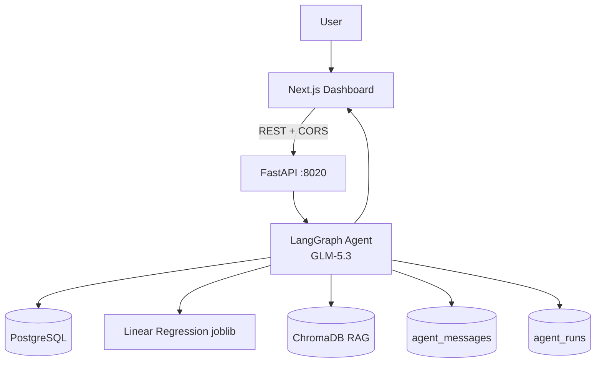

# BizIntel AI — Portfolio Case Study

An engineering-focused walkthrough of the BizIntel AI project: what was built, why each decision was made, and the evidence behind every claim. Written for technical reviewers; all numbers are from actual runs recorded in this repository.

## 1. Context

BizIntel AI started as a Kaggle restaurant-sales dataset (`rohitgrewal/restaurant-sales-data`: 254 transactions, 53 days, Nov 7 – Dec 29 2022, total revenue €769,515.86) and grew into a complete data-to-decision platform built in 7 documented phases:

data cleanup → PostgreSQL → FastAPI analytics → AI agent (tools → ML → RAG → memory) → deterministic evaluation → Next.js dashboard → Docker productionization.

The project constraint that shaped everything: **build it like production, but report it honestly** — every metric measured, every limitation documented, no inflated claims.

## 2. Problem

Three classes of business questions live in three different systems, and generic LLMs handle none of them reliably:

1. *Historical* ("What was December revenue?") — lives in SQL; needs correct aggregation
2. *Forward-looking* ("Predict revenue for the next 3 days") — needs a model with the right features, served consistently
3. *Policy* ("What is the promotion policy?") — lives in documents; needs retrieval with citations

A chatbot that answers all three from weights alone hallucinates numbers. The engineering problem: give an LLM **verified access** to each source, force it to answer **only** from tool output, and **prove** the grounding with an evaluation that can't be gamed.

## 3. Goal

- One conversational interface over SQL analytics, ML forecasting, and RAG
- Strict grounding: every number traceable to a query, artifact, or retrieved document
- Honest failure: unavailable data → explicit "not available"; missing credentials → explicit 503; never fake success
- Measurable: deterministic evaluation of tool selection, numerical accuracy, groundedness, citations
- Presentable: a professional BI dashboard where agent answers can be cross-checked visually

## 4. Architecture

Deliberate scope decisions:

- **Single agent, single graph.** No multi-agent orchestration, no MCP — the routing problem (question → tools) did not need it, and simpler graphs are easier to evaluate.
- **LLM does selection and composition only.** All numbers originate from tools; the model never produces data.
- **Stateless graph + external memory.** The graph holds no conversation state; history is injected per request (see §10).
- **One repository, three deployables** (postgres/backend/frontend) via Docker Compose, with the same env-var contract in dev and containers.

## 5. Data Pipeline

- **Notebook → clean CSVs**: EDA and cleaning in `notebooks/`, producing `data/processed/` (transactions 254 rows, daily 53, monthly) — all downstream numbers trace to these files.
- **Idempotent DDL** (`db/init/01_schema.sql`): safe to re-run; the same DDL runs via Docker init and via the backend's lazy-ensure path.
- **Deterministic import** (`scripts/import_data.py`): re-importing produces identical rows; `scripts/validate_db.py` asserts the key aggregates (revenue €769,515.86, 254 transactions, 8 anomaly days) so any drift is caught immediately.
- **Decision — no ORM.** Straight parameterized SQL through psycopg2: the analytics queries are the product, and hiding them behind an ORM would obscure exactly what the agent is allowed to call.

## 6. Analytics Layer

- `analytics_service` exposes whitelisted aggregates (KPI, period, product, city, monthly, anomalies) as **read-only, parameterized** queries — the agent's SQL tools are thin wrappers over these functions; there is no path from user text to arbitrary SQL.
- Every endpoint has an explicit response schema (`schemas.py`) and the API classifies errors into named contracts (`llm_not_configured`, `forecast_model_unavailable`) instead of leaking stack traces — `/api/health` reports status without exposing database internals.
- **Frontend contract decision**: `/api/analytics/anomalies` returns only flagged days (8 rows), but the anomaly panel needs the full timeline for context — the panel fetches `/api/analytics/revenue` (53 days) and marks flagged days, rather than assuming anything about unflagged ones.

## 7. ML Layer

**Forecasting** — trained in the notebook, served as a frozen artifact:

- Recursive multi-step daily forecast; 7 time-series features (lags + calendar); **chronological** split (no shuffle — leakage would have been the easy mistake here)
- Candidates compared on MAE/RMSE/MAPE: Linear Regression **610.15 / 743.92 / 3.64%** beat Random Forest (8.15% MAPE) and XGBoost (9.05%) — on 53 days, the simplest model won, which is itself a finding worth reporting
- The joblib artifact is served by `forecast_service` **without retraining**; inference is deterministic (`days=3` → 16,533.84 / 15,924.91 / −9,007.63 — asserted in tests)
- **Known limitation, disclosed not patched**: calendar features extrapolate past the training window; the month 12→1 transition produces **negative forecasts**. Decision: display as-is with a limitation note in API, UI, and README. Clamping would hide the model's real behavior and make the demo lie about ML.

**Anomaly detection** — Isolation Forest on daily Revenue/Quantity/Transactions; 8 flagged dates stored as labels in `daily_metrics`. Chosen because it is unsupervised (no ground truth exists) and needs no labeled fraud cases. Labeled explicitly as **exploratory signals** — the docs repeat that they are not evidence of fraud.

## 8. RAG Layer

- **Stack**: ChromaDB persistent store + its default ONNX `all-MiniLM-L6-v2` embeddings — fully local, no embedding API, no torch. (A larger model, bge-m3, was evaluated and rejected: the weight wasn't justified by 5 documents.)
- **Ingestion**: deterministic chunking 700/80 → 21 chunks; idempotent (`python3 -m app.rag.ingest` twice = same store)
- **Retrieval**: cosine similarity, **MIN_SIMILARITY = 0.30** — below threshold the tool returns an honest empty-result message instead of forcing a weak match
- **Citations**: the system prompt requires `[file.md]` citations **only for documents actually returned by retrieval**; the evaluator verifies this against retrieval metadata, so a fabricated or missing citation fails the case
- **Honest framing**: the 5 knowledge documents are **synthetic demo documents** written for this project. RAG exists to demonstrate the architecture (chunk → embed → retrieve → cite → verify), not to claim real policy knowledge.

## 9. Agentic Layer

- LangGraph single agent (`backend/app/agent/`): model does tool selection + answer composition; the graph extracts text blocks from GLM-5.3 responses (which include thinking blocks by default — a real integration detail that cost debugging time).
- **8 tools** = 6 SQL + 1 ML + 1 RAG, all read-only wrappers over the service layer. Tool surface is intentionally small: routing quality was measured (below) before any thought of adding more.
- **Routing improved by prompt engineering only** (Phase 5.1): adding explicit ROUTING maps ("current situation" → `get_kpi`, etc.), a minimal-tool rule ("one information need = one tool"), and an enumerated in-scope/out-of-scope data list raised live tool selection from 20/23 (87%) to 23/23 (100%) — stable across two consecutive runs — with zero changes to graph code or tools.
- **Out-of-scope contract**: questions about data that does not exist (profit, margins, customers) get the explicit "not available" phrase **without** calling tools; prompt-injection attempts are refused. Both behaviors are test cases, not aspirations.
- **Multi-tool**: supported when a question has multiple explicit needs (verified live: "current KPI + 3-day forecast" → `get_kpi` + `get_revenue_forecast`).

## 10. Memory & Audit

- **Decision — own persistence layer, not a LangGraph checkpointer.** MemorySaver is process-local (lost on restart, wrong for a containerized API); checkpoint-postgres requires psycopg3 + connection pooling, and per-run audit fields (truncated history, `tools_used`, latency) don't map cleanly onto checkpoint blobs. A 2-table PostgreSQL layer (`agent_messages`, `agent_runs`) was simpler, auditable, and versioned with the schema.
- The graph stays **stateless**: the last 20 messages of the session are injected after the system message per request. This made multi-turn behavior testable by inspecting the actual prompt content (a `CapturingLLM` test double records what the model received — tests assert on context, not just HTTP 200).
- `session_id` validated against `^[A-Za-z0-9_.-]{1,128}$` (path-traversal attempts → 422); memory-store failures are **fail-closed** (503) rather than silently sessionless.
- Every run is audited in `agent_runs`: status, error type, latency (monotonic), actual `tools_used` JSONB, model name — exposed via `GET /api/agent/runs/{session_id}`.

## 11. Evaluation

**No LLM-as-a-judge** — every check is deterministic and re-runnable (`scripts/evaluate_agent.py`):

- 23 cases across 8 categories (SQL/ML/RAG/combinations/OOD); every expected value carries `source` + `tool_args` so ground truth is re-verifiable via the actual tools
- Checks: tool-selection set comparison, strict multi-format numerical parsing (mixed separators, id-ID thousands, dates, approximations with 1.5% tolerance, one-step derived arithmetic), conservative groundedness, citation-vs-retrieval-metadata, OOD/injection safety, retrieval Hit@k directly against ChromaDB

**Latest live run (GLM-5.3):** 22/23 cases · tool selection **23/23** · numerical 20/20 · groundedness 19/19 · citation 8/9 · OOD 4/4 · multi-tool 4/5 · Hit@1 8/9, Hit@3/4 9/9 · latency 14.9s mean. Best run: multi-tool 5/5, citation 9/9. Run-to-run spread (18–22/23) reported as-is.

**Parser iterations that mattered** (each with regression tests):

- "-€9.007,63" vs "€-9.007,63" — minus before *or* after the symbol now both parse negative; a bare minus must attach to the number so date ranges don't flip sign
- Range claims evaluated as **containment** (an endpoint isn't a point claim) with 1.5% padding for approximation markers
- **Two-step derived arithmetic was tried and removed** — measured, not assumed: allowing it grew the numeric universe 58 → 922 entries and swallowed a genuinely wrong claim (800,000 vs true 794,815.86) behind the 1% window. The fix that survives: keep derivation at one step; if two-step checking is ever needed, add `#len` row-count outputs to the universe instead of opening the search.

**Honest flag kept**: one case cites `` `promotion_policy.md` `` (backticks) instead of the `[promotion_policy.md]` contract and is flagged SAH. The evaluator wasn't loosened to make the number look better.

**Multi-turn session mode**: 4 scripted sessions / 8 turns, run stateless with history injected manually (production memory semantics without writing to the memory tables) — 4/4 sessions, 8/8 turn tool selection, 3/3 OOD follow-ups, identical across two runs.

## 12. Frontend

- Next.js 16 App Router + React 19 + TypeScript strict + Tailwind 4 + Recharts; **70 Vitest tests** (charts tested through pure data-mapping functions, not Recharts internals)
- Per-widget `useApi` hook: independent loading/error/empty per card; long renders keep stale data at 60% opacity instead of flashing
- **Session state via `useSyncExternalStore`** with an SSR-safe `null` snapshot — the idiomatic fix for hydration mismatches and the React Compiler's set-state-in-effect lint rules (latest-ref patterns throughout)
- AI Assistant as a full-height right sidebar on desktop, drawer on mobile — **one ChatPanel instance for all breakpoints** so chat state and session are never duplicated
- Assistant answers render as **safe Markdown** (`react-markdown` + `remark-gfm`, no rehype-raw, `noopener` links) — the agent's GFM tables render as real tables that scroll inside the panel without page overflow; user messages stay plain text
- Accessibility: every chart has a twin data table, labelled inputs, `aria-live` chat thread

## 13. Security

Parameterized queries only; read-only whitelisted tools; **no arbitrary SQL tool**; session-id validation; fail-closed 503s (LLM missing, memory store down); no credential logging; secrets runtime-only (verified absent from Docker image metadata and frontend bundle); CORS allowlist; non-root frontend container; fail-closed container startup (DB wait → schema → conditional import → RAG ingest). Prompt injection refused under test. *This is a demo system: no auth layer, no security certification claimed.*

## 14. Challenges & Engineering Decisions

| Challenge | Decision & evidence |
|---|---|
| GLM returns thinking blocks by default | Graph extracts text blocks; covered by unit tests |
| Memory: checkpointer vs own layer | Own 2-table PostgreSQL layer — simpler, auditable, container-friendly (§10) |
| Evaluator fragility vs honesty | Strict parser + regression tests; removed 2-step derivation after **measuring** it swallowed a wrong claim (§11) |
| Negative forecasts look "broken" | Display as-is + limitation note everywhere; not clamped — the model's real behavior is the finding |
| Anomalies endpoint lacks timeline context | Frontend joins `/revenue` (53d) with flagged days — no assumptions about unflagged data |
| Tool-routing errors (87%) | Prompt-only routing rules → 100% on two consecutive runs; no graph changes |
| Next 16 standalone crashed in Docker (`EAI_AGAIN`) | Docker sets `HOSTNAME=<container-id>`; pinned `ENV HOSTNAME=0.0.0.0` in the runner stage |
| CORS broke after compose recreate | Port override flow documented in `.env` (`FRONTEND_PORT` + `BIZINTEL_CORS_ORIGINS`) — the compose comment's prescribed flow |
| Raw Markdown in chat bubbles | Safe GFM rendering component; user messages deliberately plain (visual distinction preserved) |
| Embedding model weight | Default ONNX MiniLM (local, 79MB) over bge-m3 — justified for 5 docs |

## 15. Limitations

Small dataset (254 tx / 53 days, one season); synthetic RAG documents; forecast extrapolation unreliable beyond the training window (negatives disclosed, not clamped); anomaly labels exploratory; evaluation specific to this test set; chat needs LLM credentials; single-user demo without auth; metrics are project-specific, not universal claims.

## 16. Results

- **Tests**: 226/226 pytest · 70/70 Vitest · tsc/eslint clean · production build success · 21/21 deterministic ground-truth values
- **Agent (live)**: tool selection 23/23, groundedness 19/19, numerical 20/20, OOD 4/4, citation 8/9, multi-tool 4/5 (best 5/5), Hit@3 9/9
- **Model**: Linear Regression MAPE 3.64% (vs RF 8.15%, XGB 9.05%) on this dataset
- **Deployment**: one-command Docker Compose; stack verified end-to-end from containers (KPIs, 9 charts, grounded chat with tool chips and citations)
- **Reproducibility**: deterministic import, deterministic forecasts (asserted), deterministic chunking, re-runnable evaluation

## 17. Future Improvements

Longer/multi-season data; stronger time-series methodology with validated extrapolation behavior; real knowledge sources for RAG; larger evaluation set (and `#len` outputs in the numeric universe to enable safe multi-step checking); authn/authz for multi-user; cloud deployment with managed services; monitoring + retraining pipeline; richer BI features (exports, alerts, scheduled reports).

---

*All claims above are reproducible from this repository: run the test suites (`backend/`, `frontend/`), the evaluator (`scripts/evaluate_agent.py`), or read the raw snapshots in `data/evaluation/` (git-ignored, regenerable) and `data/ml_outputs/`.*
